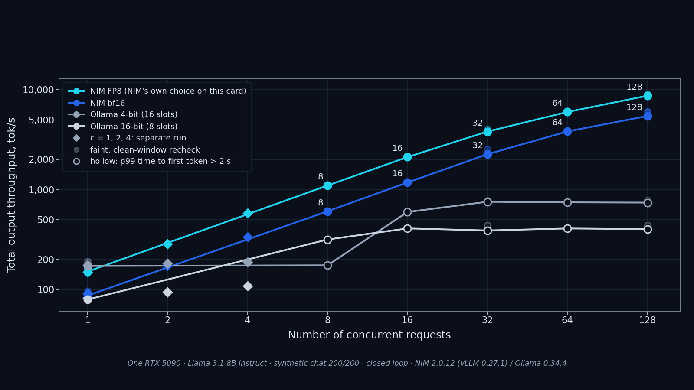

# Vol.1 (renewed 2026-09) · Why NIM? Llama 3.1 8B on one RTX 5090, from 1 to 128 concurrent requests

Forum post: <https://forums.developer.nvidia.com/t/why-nim-llama-3-1-8b-on-one-rtx-5090-from-1-to-128-concurrent-requests/384818>

> **Reproduce:** `git checkout vol1`. That tag is the repository as the Vol.1 article describes it: every run of this volume, the 29 September FP8 recheck and this README. The harnesses are frozen with the paths they were written with; [`../PATH_MAP.md`](../PATH_MAP.md) maps them to this directory.

A question we keep getting from teams that run on a single workstation GPU: *why use NIM instead of just running Ollama?* So we measured it. Llama 3.1 8B Instruct, one RTX 5090, NIM 2.0.12, from one request at a time up to 128, with Ollama as the reference point. We also checked whether the faster configurations answer worse.

**TL;DR**

- **One user: Ollama's 4-bit build is faster** (172–183 vs 87 tok/s), because it reads about 3.3× fewer bytes per token. NIM itself adds nothing on top of the vLLM it ships with: same weights, same speed, the same 50 answers byte for byte.
- **Once requests overlap, NIM pulls ahead.** The crossover is between 2 and 4 concurrent requests. NIM is 3.5× ahead at 8 and **7.4× at 128** (5,458 vs 741 tok/s, against the fastest Ollama configuration we could build).
- **NIM held the MLPerf Inference server latency target up to 128 concurrent requests.** None of the Ollama configurations held it past one.
- **NIM's default on this card is FP8.** It gives another 1.5× over bf16 (9,062 tok/s at 128). MMLU showed no measurable change; GSM8K was 1.5 points lower, which we could not separate from zero.

*All throughput numbers: synthetic chat requests, 200 tokens in / 200 out, closed loop, one engine on the GPU at a time. MLPerf server target: p99 TTFT ≤ 2 s and p99 TPOT ≤ 100 ms.*


*One RTX 5090 · Llama 3.1 8B Instruct · synthetic chat 200/200 · closed loop · NIM 2.0.12 (vLLM 0.27.1) / Ollama 0.34.4*

## Run it

This is the configuration we measured (FP8, NIM's own choice on this card):

```bash
docker run -d --gpus all -p 8000:8000 \
  -e NGC_API_KEY \
  -e NIM_MODEL_PROFILE=c4789f7af56c770c1c88b73da666886365534d6980b6b922b41fd97036c77d73 \
  -e NIM_MAX_MODEL_LEN=8192 \
  -e VLLM_USE_V2_MODEL_RUNNER=0 \
  -v ~/.cache/nim:/opt/nim/.cache \
  nvcr.io/nim/meta/llama-3.1-8b-instruct:2.0.12
```

For bf16, use profile `092ed4213624e774d24cdaf84e3b6222839bab2008a21d3c214ab46626366f90`. On this host (Docker Desktop on WSL2) this Llama image needs `VLLM_USE_V2_MODEL_RUNNER=0`; without it, start-up fails with `UVA is not available`.

## Results

**Total throughput, tok/s** (Llama 3.1 8B, synthetic chat 200/200, 25 September run)

| Concurrent requests | 1 | 8 | 32 | 128 |
|---|---|---|---|---|
| Ollama, 4-bit, 16 slots (tuned) | 172 | 175 | 755 | 741 |
| Ollama, 16-bit, 8 slots (tuned) | 79 | 317 | 390 | 402 |
| **NIM, bf16** | 87 | 607 | 2,262 | **5,458** |
| **NIM, FP8** (default) | 151 | 1,099 | 3,817 | **8,713** |

**p99 time to first token** at 128 concurrent requests: NIM bf16 1.84 s, NIM FP8 0.75 s, tuned 4-bit Ollama 31.9 s.

*A later recheck of FP8 with the card otherwise idle measured 9,062 tok/s at 128, 1.50× bf16 NIM in the same window (section D below).*

**The same sweep as a curve.** Total output throughput against the number of concurrent requests, both on logarithmic axes. A line is the run of the table above; the diamonds at 1, 2 and 4 are a separate run that located the crossover; the faint markers are the rechecks with the card otherwise idle; a hollow marker means the p99 time to first token is over 2 s, outside the MLPerf server target.



*Dashed segments: this run has no level between 1 and 8; the diamonds at 2 and 4 come from a separate run.*

*Figure added on 2026-10-01, revised 2026-10-02; drawn from the data at tag `vol1` by [`figures/plot_throughput_concurrency.py`](figures/plot_throughput_concurrency.py), in a light and a dark version (SVG and PNG). Every point is listed with its source file and key in [`figures/throughput_concurrency_points.json`](figures/throughput_concurrency_points.json).*

**Does faster mean worse answers?** The four configurations on the same task sets (lm-evaluation-harness 0.4.13, temperature 0, identical requests), each compared with bf16 NIM item by item:

| vs bf16 NIM (points, 95% CI) | FP8 NIM | 16-bit Ollama | 4-bit Ollama |
|---|---|---|---|
| MMLU, 2,850-question sample (bf16 NIM: 68.9%) | −0.04 [−0.81, +0.74] | +0.11 [−0.53, +0.74] | −0.25 [−1.23, +0.74] |
| GSM8K, all 1,319 (bf16 NIM: 85.6%) | −1.52 [−3.11, 0.00] | −1.29 [−2.88, +0.30] | **−2.43 [−4.40, −0.53]** |

General knowledge held everywhere. On multi-step math, the 4-bit build lost a measurable 2.4 points. Running 32 requests at once did not change FP8's accuracy (84.4% vs 84.6% on GSM8K).

**Why NIM pulls ahead.** For one user, precision decides the speed; once requests overlap, the engine does. At matched 16-bit precision, Ollama and NIM are within 10% for one user (79 vs 87 tok/s); at 128 the gap is 13.6× (402 vs 5,458). What NIM adds on top of the vLLM inside it is the configuration: it picks a profile for the card (FP8 here) and ships it pinned in one image.

## Claim → evidence

Every number above and in the forum post, with the file it comes from and the key inside that file. Paths are relative to this directory. `Check` says how the number relates to the stored value: `rounds` (the stored value rounds to it), `equals`, or `text` (the quoted text is in the file).

**P59** below is `results/p59_nim_value/analysis.json` (the 25 September run); arm names: `N-BF16`, `N-FP8` (NIM), `O-Q4` (Ollama 4-bit, 16 slots), `O-Q4-def` (Ollama 4-bit, slots left to Ollama), `O-FP16` (Ollama 16-bit, 8 slots); `C` is the chat profile.

| In the post | Number | File | Key | Check |
|---|---|---|---|---|
| One user, Ollama 4-bit, tuned · default slots | 172 · 183 | `results/p59_nim_value/analysis.json` | `levels.{O-Q4,O-Q4-def}\|C\|main.1.total_tps` | rounds |
| One user, NIM bf16 | 87 | `results/p59_nim_value/analysis.json` | `levels.N-BF16\|C\|main.1.total_tps` | rounds |
| The 4-bit build reads about 3.3× fewer bytes per token | 3.3× | `results/p59_nim_value/analysis.json` | `arms.N-BF16.gate_health.bytes_per_token / arms.O-Q4.gate_health.bytes_per_token` | rounds |
| NIM and the vLLM inside it: same speed (rate ratio) | 0.99 | `results/p54_engine/single/analysis.json` | `conclusions.V_over_N.generation_rate.ratio_of_means` | rounds |
| … the same 50 answers byte for byte | 50 / 50 | `results/p54_engine/README.md` | `Responses byte-identical (SHA-256 of the streamed text) \| \| \| **50 / 50**` | text |
| The crossover is between 2 and 4 | "between 2 and 4: N-BF16 ahead from 4" | `results/p62_levels/analysis.json` | `crossings.N-BF16 vs O-Q4\|C\|total_tps.crossings[0]` | equals |
| 3.5× ahead at 8 | 3.5× | `results/p59_nim_value/analysis.json` | `levels.N-BF16\|C\|main.8.total_tps / levels.O-Q4\|C\|main.8.total_tps` | rounds |
| 7.4× at 128 | 7.4× | `results/p59_nim_value/analysis.json` | `levels.N-BF16\|C\|main.128.total_tps / levels.O-Q4\|C\|main.128.total_tps` | rounds |
| NIM held the server target at 128 (bf16) | true | `results/p59_nim_value/analysis.json` | `levels.N-BF16\|C\|main.128.in_server_slo` | equals |
| NIM held the server target at 128 (FP8) | true | `results/p59_nim_value/analysis.json` | `levels.N-FP8\|C\|main.128.in_server_slo` | equals |
| No Ollama configuration held it past one: 4-bit tuned, at 8 | false | `results/p59_nim_value/analysis.json` | `levels.O-Q4\|C\|main.8.in_server_slo` | equals |
| … 4-bit default slots, at 8 | false | `results/p59_nim_value/analysis.json` | `levels.O-Q4-def\|C\|main.8.in_server_slo` | equals |
| … 16-bit, at 8 | false | `results/p59_nim_value/analysis.json` | `levels.O-FP16\|C\|main.8.in_server_slo` | equals |
| FP8 gives another 1.5× over bf16 (clean window) | 1.50× | `results/p78_fp8_clean/analysis.json` | `R2.value` | rounds |
| FP8 at 128, clean window | 9,062 | `results/p78_fp8_clean/analysis.json` | `tok_s.N-FP8\|128` | rounds |
| Table: Ollama 4-bit, 16 slots, at 1 · 8 · 32 · 128 | 172 · 175 · 755 · 741 | `results/p59_nim_value/analysis.json` | `levels.O-Q4\|C\|main.{1,8,32,128}.total_tps` | rounds |
| Table: Ollama 16-bit, 8 slots | 79 · 317 · 390 · 402 | `results/p59_nim_value/analysis.json` | `levels.O-FP16\|C\|main.{1,8,32,128}.total_tps` | rounds |
| Table: NIM bf16 | 87 · 607 · 2,262 · 5,458 | `results/p59_nim_value/analysis.json` | `levels.N-BF16\|C\|main.{1,8,32,128}.total_tps` | rounds |
| Table: NIM FP8 | 151 · 1,099 · 3,817 · 8,713 | `results/p59_nim_value/analysis.json` | `levels.N-FP8\|C\|main.{1,8,32,128}.total_tps` | rounds |
| p99 TTFT at 128, s: NIM bf16 · NIM FP8 · tuned 4-bit Ollama | 1.84 · 0.75 · 31.9 | `results/p59_nim_value/analysis.json` | `levels.{N-BF16,N-FP8,O-Q4}\|C\|main.128.ttft_p99_ms / 1000` | rounds |
| Matched 16-bit precision at 128 | 13.6× | `results/p59_nim_value/analysis.json` | `levels.N-BF16\|C\|main.128.total_tps / levels.O-FP16\|C\|main.128.total_tps` | rounds |
| MMLU accuracy, bf16 NIM | 68.9% | `results/p62_quality/analysis.json` | `cells.N-BF16\|mmlu.accuracy_pct` | rounds |
| MMLU, FP8 NIM vs bf16: difference · CI low · CI high | −0.04 · −0.81 · +0.74 | `results/p62_quality/analysis.json` | `paired_vs_ref.N-FP8\|mmlu.paired.{diff_pp,ci95_pp[0],ci95_pp[1]}` | rounds |
| MMLU, 16-bit Ollama | +0.11 · −0.53 · +0.74 | `results/p62_quality/analysis.json` | `paired_vs_ref.O-FP16\|mmlu.paired.{diff_pp,ci95_pp[0],ci95_pp[1]}` | rounds |
| MMLU, 4-bit Ollama | −0.25 · −1.23 · +0.74 | `results/p62_quality/analysis.json` | `paired_vs_ref.O-Q4\|mmlu.paired.{diff_pp,ci95_pp[0],ci95_pp[1]}` | rounds |
| GSM8K accuracy, bf16 NIM | 85.6% | `results/p63_gsm8k/analysis.json` | `cells.N-BF16.accuracy_pct` | rounds |
| GSM8K, FP8 NIM | −1.52 · −3.11 · 0.00 | `results/p63_gsm8k/analysis.json` | `comparisons.N-FP8.paired.{diff_pp,ci95_pp[0],ci95_pp[1]}` | rounds |
| GSM8K, 16-bit Ollama | −1.29 · −2.88 · +0.30 | `results/p63_gsm8k/analysis.json` | `comparisons.O-FP16.paired.{diff_pp,ci95_pp[0],ci95_pp[1]}` | rounds |
| GSM8K, 4-bit Ollama | −2.43 · −4.40 · −0.53 | `results/p63_gsm8k/analysis.json` | `comparisons.O-Q4.paired.{diff_pp,ci95_pp[0],ci95_pp[1]}` | rounds |
| FP8 on GSM8K at 1 · 32 concurrent requests | 84.4% · 84.6% | `results/p62_quality/analysis.json` | `concurrency_fp8_gsm8k.accuracy_pct.{c1,c32}` | rounds |
| Ollama picks 1 parallel slot by default | 1 | `results/p59_nim_value/analysis.json` | `arms.O-Q4-def.ollama_num_parallel.runner_from_log` | equals |
| Slots × context has to fit in VRAM: the largest slot count that loaded fully on the GPU at context 8,192 (4-bit) | 16 | `results/p59_nim_value/analysis.json` | `arms.O-Q4.ollama_num_parallel.set_at_8192` | equals |
| Pin `NIM_MODEL_PROFILE` by its 64-character id: the display form with its suffix is rejected | — | `../vol3-judges/results/p17_concurrency/README.md` | `passed verbatim, the recorded form is rejected by NIM` | text |
| … the error NIM gave for the display form | — | `../vol3-judges/results/p28_judge_isolation/PREDICTION_V1_SUPERSEDED.md` | `NIM matched neither the id nor the description, and reported "no matching profile_id or profile description is found in manifest"` | text |
| `localhost` cost about 2 s per request (median, ms) | 2,059.9 | `../vol3-judges/results/p20_coresidence_v2/analysis.json` | `conclusions.address_delay_ollama_localhost_minus_loopback.ttft_ms.median` | rounds |
| Run it: the FP8 profile id | — | `scripts/p59_nim_value.py` | `"N-FP8":    {"kind": "nim", "profile": "c4789f7af56c770c1c88b73da666886365534d6980b6b922b41fd97036c77d73"}` | text |
| Run it: the bf16 profile id and the environment | — | `scripts/p54_engine.py` | `N_MEASURED_ENV = {"NIM_MODEL_PROFILE": PROFILE, "NIM_MAX_MODEL_LEN": "8192", "VLLM_USE_V2_MODEL_RUNNER": "0"}` | text |
| Without the runner switch: `UVA is not available` | — | `results/p54_engine/attempts_summary.json` | `RuntimeError: UVA is not available` | text |
| The March post's two arms at 75% and 3.4% of the card's peak bandwidth | — | `../vol3-judges/BASELINE.md` | `sit at 75% and 3.4% of this card's peak` | text |

**How to check a row:** open the file, follow the key, compare. Or check every row at once: `python ../tools/check_claims.py README.md` (from this directory). To recompute the analysis files from the raw rows, run the analysis script named in each result directory's README (for example `python scripts/p59_analyze.py`); the quality analyses reproduce byte for byte from the published per-item fields (`results/p62_quality/recompute_check.txt`).

## How it was measured

- **Decided before the run.** Each run has a pre-registration file (`prediction_*.json`) with its thresholds, predictions and the SHA-256 of the harness, frozen and hashed (`.sha256`) before the first container starts. A failed prediction is reported as failed.
- **Both arms must be healthy.** A single-stream generation rate implies a memory bandwidth (bytes read per token × tokens per second). An arm must reach at least 40% of the card's 1,792 GB/s before any ratio is computed (`arms.<arm>.gate_health`); Ollama arms must also show 100% GPU in `ollama ps`.
- **Closed-loop concurrency.** AIPerf 0.11.0 keeps exactly N requests in flight; synthetic prompts with fixed input and output lengths (`ignore_eos`), 60 s per level after a discarded warm-up level, a fresh prompt set per level, and a detector that refuses a sweep whose calibration prompt hits the prefix cache.
- **The latency target is fixed first.** MLPerf Inference v5.1, Llama 3.1-8B server scenario: p99 TTFT ≤ 2 s and p99 TPOT ≤ 100 ms. A level is inside or outside; the ceiling is the largest level inside.
- **Quality is compared item by item.** The same requests go to every arm (0 request-hash mismatches); the paired difference against bf16 NIM carries a 95% interval, and the method is checked on itself (bf16 against bf16: 0.00 [−0.83, +0.83] on GSM8K).
- **Clean-window rechecks.** The headline cells were measured again with an idle-card gate before every cell (utilization ≤ 2% and ≤ 45 W over 10 s).
- **The hash chain.** `python ../tools/bound_files.py --history` lists every recorded SHA-256 and verifies the file it binds, as it stood beside its pre-registration.

## Measurement conditions and what is not explained

Stated plainly, because a reader who reruns this will meet the same things.

- **The 25 September run had other load on the desktop GPU.** Its idle sample before the first container read 19% utilization and 50 W, and its levels ended at 3–23% utilization (`results/p59_nim_value/ctx.txt`; `levels.jsonl` → `gpu_end`; summarised in `results/p70_clean_recheck/README.md`). The card drives the desktop, and which desktop applications were open was not recorded.
- **Re-measured with the card idle, the numbers are 5–12% higher and the ratios hold.** On 27 September (`results/p70_clean_recheck/`): bf16 NIM 6,043 tok/s at 128 (5,458 before), 4-bit Ollama 780 (741), 16-bit Ollama 440 (402); the published ratios reproduce within 6%. The tables above keep the 25 September values because they are the complete sweep.
- **FP8 had no clean-window figure until 29 September.** On 27 September its arm was refused by the prefix-cache detector: after a container start, the first of two different prompts is slow for a reason that is not a cache. With a detector that separates the two cases, pre-registered, FP8 measured 9,062 tok/s at 128 (`results/p78_fp8_clean/`). Why the first request after a start is slow is unexplained.
- **FP8's prefill time depends on the prompt's content.** The server's own histogram shows 138 ms for the harness's prompts and 220 ms for AIPerf's prompts of the same length; bf16 shows no such gap (`results/p62_rag/`). The cause was not found, so the RAG-profile conclusion for FP8 is null.
- **The 4-bit build's total stays flat from 1 to 9 concurrent requests** (175–188 tok/s with 16 slots) and then steps up. The pre-registered explanation failed; the cause is not determined (`results/p62_levels/`).
- **Session to session, the same cell moves.** Anchors repeated in a later session were 0.955–1.146 of the first run (`results/p62_levels/analysis.json` → `anchors_vs_p59`).
- **Two quality cells are null by their own gates.** In the first quality run, GSM8K and IFEval reached the output cap on 2.0–3.3% of items against a gate of 1%; GSM8K was measured again with a larger cap (`results/p63_gsm8k/`), IFEval stays descriptive.
- **Windows and WSL2.** On this host `localhost` resolves to IPv6 first and costs about 2 s per request against a server that listens on IPv4 only; every run addresses `127.0.0.1`. The card also drives the Windows desktop, so "idle" is checked by a gate on utilization and power before each cell rather than assumed.

## Full tables and the detailed write-up

What follows is the write-up section by section. Full level tables, failed predictions and voided runs are in each result directory's README: `results/p54_engine/` (NIM against the vLLM inside it), `results/p59_nim_value/` (the concurrency sweep), `results/p62_levels/`, `results/p62_rag/`, `results/p62_quality/`, `results/p63_gsm8k/`, `results/p70_clean_recheck/`, `results/p78_fp8_clean/`. The re-examination of the March 2026 post is in [`../vol3-judges/BASELINE.md`](../vol3-judges/BASELINE.md), section 12.

### Ratios by concurrency

| Concurrent requests | NIM bf16 ÷ 4-bit (16 slots), total | NIM FP8 ÷ 4-bit, total | NIM bf16 ÷ 16-bit, total (matched precision) | NIM bf16 ÷ 4-bit, per-user end-to-end |
|---|---|---|---|---|
| 1 | 0.51 | 0.88 | 1.10 | 0.51 |
| 8 | 3.5 | 6.3 | 1.9 | 3.2 |
| 16 | 2.0 | 3.6 | 2.9 | 1.9 |
| 32 | 3.0 | 5.1 | 5.8 | 2.8 |
| 64 | 5.1 | 8.0 | 9.4 | 4.1 |
| **128** | **7.4** (5,458 / 741) | **11.8**¹ (8,713 / 741) | **13.6** (5,458 / 402) | **4.1** (45 / 11) |

¹ *FP8 figures are from the 25 September run. A clean-window recheck on 29 September measured 9,062 tok/s at 128 concurrent requests: 11.6× the clean-window 4-bit figure and 1.50× bf16 NIM in the same window (`results/p78_fp8_clean/`, section D).*

> Every ratio above is a division of two cells in `results/p59_nim_value/README.md`. At 128 concurrent requests NIM was still inside the MLPerf server SLO; the Ollama arms had left it at 8, so the ratios above 8 compare a configuration that is serving with one that is queueing. A ratio is a function of concurrency, not a property of an engine, and is quoted only with the concurrency, the precision of both arms, the input shape (synthetic chat, 200 in / 200 out) and whether the SLO held.

## Scope

Vol.1 as first published (2026-03) is `../benchmark/` and is not changed by anything here; this directory is the renewed Vol.1. This directory holds the write-up of a revisit that asks a narrower question than the March 2026 Vol.1's E2 did: on one card, one model, one set of weight files and one precision, what does the NIM container's pre-selected configuration amount to against the same inference engine started by hand? The measurements live in `../vol1-nim/results/p54_engine/`; the section of record is in `../vol2-nemotron/BASELINE.md`.

**Codes.** P54, P59, P62 and P63 (and the Q1–Q4 inside P62) are this lab's run identifiers: one per measurement request, numbered in order. They appear in directory, script and pre-registration names so that a file can be traced to the run that produced it. They carry no other meaning, and each run's README states what it measured.

**Setup.** Llama 3.1 8B Instruct, bf16, one RTX 5090 (32,607 MiB, 1,792 GB/s, driver 591.86), both arms from the same snapshot of the NIM cache: 16,060,556,376 bytes of safetensors, the same file hashes in both containers (`stack.json`, hashed inside a container through the same mount both arms use).

- **Arm N** is the NIM container: NIM 2.0.12, profile `092ed421…` (bf16), `NIM_MAX_MODEL_LEN` 8192 and `VLLM_USE_V2_MODEL_RUNNER=0`.
- **Arm V** is the upstream `vllm/vllm-openai:v0.27.1` container. It has the same vLLM build commit (`6e448d0e`) and the same torch, CUDA, flashinfer, triton and transformers as the engine inside N.
- **V's engine arguments are NIM's own.** They are the argument list NIM resolves for N's configuration (`nim-serve --dry-run`), with four edits: the model path; NIM's internal port and host; and NIM's two server-layer middlewares, which do not exist outside NIM.

What still differs is listed in the pre-registration and in `../vol1-nim/results/p54_engine/README.md`: the request path through NIM's proxy, NIM's in-process plugins, the OS base, and the KV cache the engine sizes for itself at start (N 97,328 tokens, V 107,728). Pre-registration `prediction_p54_engine.json`, frozen 2026-09-24T00:12:58+0800, before the first container.

## A · Single stream: the same engine, the same answers

Four alternating blocks (N, V, N, V) over the 50 questions of the co-residence sample (the file is named in `results/p54_engine/README.md`), one request at a time, `max_tokens` 4096, temperature 0, top_p 0.9, streaming with usage; 2026-09-24 00:40–01:06. All preconditions held.

| | N · NIM 2.0.12 | V · vLLM 0.27.1 | V over N (ratio of means, 95% CI over questions) |
|---|---|---|---|
| Arm health: generation rate × 16.06 GB per token, share of 1,792 GB/s | 98.4 tok/s · **88.2%** | 98.2 tok/s · **88.0%** | gate passes on both |
| Generation rate, median | 98.4 tok/s | 98.2 tok/s | 0.990 [0.963, 1.020] |
| Time to first token, median | 31.4 ms | 31.7 ms | 0.992 [0.881, 1.124] |
| Time to the end of the answer, median | 5,066 ms | 5,053 ms | 1.012 [1.004, 1.019] |
| Completion tokens, median | 483.5 | 483.5 | 1.000 |
| Answers byte-identical across the two arms | | | **50 of 50** |

**At temperature 0 the two arms wrote the same 50 answers, byte for byte, at the same speed.** Both run at 88% of the card's memory bandwidth, the ceiling a bandwidth-bound decoder can approach. The rate difference is inside the run-to-run spread; the answer-time difference is about 1%. NIM's proxy hop does not show in the median time to first token. The pre-registered prediction that it would add up to 15 ms **failed**.

**Concurrency, the same.** With `p53_concurrency_v2`'s harness and SLOs unchanged (`../vol1-nim/results/p54_engine/README.md`), the chat profile (200/200) gives both arms the same ceilings: **256** concurrent requests inside the MLPerf server SLO and **32** inside the interactive one, at about 6,100–6,300 tok/s at the top. The fresh-container repeats agree within 0.2%, and the 3–5% gap in the main sweeps is container to container. The RAG profile (3,500/500) has **no conclusion**. The harness's own calibration prompt hits vLLM's prefix cache on this model, and its pre-registered gate refuses the sweep. That defect is the harness's, not either engine's. Its level tables show both arms running out of KV cache at 26–39 sequences. V is 7–8% ahead there, in line with the 10.7% more KV cache it sized for itself at start.

This is what the physics allows. A healthy engine decoding one stream reads the weights once per token, so two healthy engines on one card, one model and one precision can differ by little. The ratio that originally led the March 2026 Vol.1 belongs to that configuration: two engines, two precisions, and one arm largely outside GPU memory (the account that closes the March 2026 comparison: [`../CHANGELOG.md`](../CHANGELOG.md), 2026-09-19).

## B · What it takes to get a serving configuration

Each arm started from nothing set and added one setting after each failed start, along a ladder written in the pre-registration. A start counts once it is READY and answers a probe request. Every attempt is a row in `../vol1-nim/results/p54_engine/attempts.jsonl`.

| | Attempts to a serving start | Settings needed | Settings in the measured configuration |
|---|---|---|---|
| N · NIM | 3 | **3**: the bf16 profile, `NIM_MAX_MODEL_LEN` 8192, `VLLM_USE_V2_MODEL_RUNNER=0` | 3 (the same) |
| V · vLLM | 3 | **2**: `--max-model-len 8192`, `VLLM_USE_V2_MODEL_RUNNER=0` | 6: the runner variable and NIM's own five engine options, made explicit |

Two findings about this host (Docker Desktop on WSL2). **Left to itself, NIM selects its FP8 profile on this card** (`vllm-fp8-tp1-pp1`, from its own dry-run). This comparison is bf16, so NIM's first rung already carried the profile setting, a setting V does not need. NIM's own FP8 choice was not started: it is a different precision and outside this question. **Both engines' default model runner fails to start here** with the same error, `RuntimeError: UVA is not available`, at the same step. vLLM logs that it detected WSL and disabled pinned memory, which points to the host rather than either image (no other host was tried), and the V1 model-runner switch fixes it on both. With only the profile chosen, NIM did not start on this host; with nothing set, vLLM did not either. The first bf16 start that served needed three settings on NIM and two on vLLM. Seconds per attempt are recorded and not summed: the ladder was known before this run.

## C · Was anything else resident on the card during E3? (read from the code and the records, no GPU)

The account that closes the March 2026 comparison ([`../CHANGELOG.md`](../CHANGELOG.md), 2026-09-19) showed that in the March 2026 Vol.1's E2 the comparison engine's model ran largely outside GPU memory. A later reading of E3 (NIM alone against NIM + NeMo Guardrails, the source of the published `+2.1%`) called it "not co-resident" because E3's time to first token was 51 ms where the co-resident E2 measured 221 ms. That was an inference from a timing. The question here is whether the code and the records say it.

**What the code says.**

- `benchmark/run_e3_guardrails.py` sends every request to one address, `NIM_URL = http://localhost:8000/v1/chat/completions` (line 31). Phase 1 (lines 238–262) calls it directly; phase 2 (lines 264–287) goes through NeMo Guardrails, whose rail config `benchmark/guardrails/config.yml` names one model, engine `nim`, `base_url http://localhost:8000/v1` (lines 6–11). The runner has no code path to the comparison engine and starts, loads or stops nothing.
- `benchmark/run_benchmark.py` (E2) builds the comparison engine's requests from the model, the messages, `stream` and `num_predict` only (lines 97–102): no setting of how long the model stays loaded, so the server's own setting applied.

**What the records say.**

- E2's results file records its window as 2026-03-30 23:11:53 → 2026-03-31 01:45:18 (`metadata`).
- `benchmark/results/e3_guardrails.json` records 09:08:24 → 09:35:50. The runner resets `started` on every invocation and can resume from its results file (lines 216 and 221–230), so the window alone could hide an earlier partial run. It does not: the 270 rows' recorded latencies sum to 1,102 s, plus 2 s cooldown after each of 270 requests = 1,642 s, against a 1,646 s window. All of E3 ran in that one invocation, 7 h 23 min after E2's last request.
- No record from either run states GPU memory, the running processes, or the comparison server's configuration. E3's rows carry no timestamps and no GPU state.

**Answer: ③ cannot be determined from the code and the records.** Nothing in E3 loaded the comparison engine's model. Whether it was still resident at 09:08 depends on two things that were not recorded: the comparison server's keep-loaded setting (its default unloads an idle model after five minutes, which would have emptied the card long before E3; a server-side setting can extend that indefinitely), and whether any other client used that server during the 7 h 23 min. The timing argument (51 ms against 221 ms) is consistent with an empty card and remains an inference.

**If it was resident**, the direction is known and the size is not: NIM-only latency would carry the co-residence cost in the denominator, so the published `+2.1%` would understate the rail's relative overhead. No corrected figure is computed here. The later re-measurement of the rail on NIM 2.0.12 alone on the card does not depend on this question.

## D · Several users at once: NIM against Ollama (`results/p59_nim_value/`)

A single-user comparison cannot stand for a serving engine; this run adds the concurrent half. Llama 3.1 8B on this card, five configurations at 1, 8, 16, 32, 64 and 128 concurrent requests: NIM 2.0.12 bf16 and fp8, and Ollama 0.34.4 with the 4-bit model (slots tuned, and left to Ollama) and the 16-bit model. On the chat profile, Ollama's 4-bit model decodes fastest for one user. NIM answers first. From 8 users on, NIM leads on total throughput and on each user's end-to-end speed. NIM keeps the MLPerf server SLO to 128 users; no Ollama configuration keeps it past one. At comparable precision the two engines are close for one user and part as soon as users overlap: the single-user gap is precision, the multi-user gap is the engine. Scope: NIM's profiles on this card are vLLM only. This section covers speed and capacity; answer quality is in section E. Details, crossing points, predictions and what is not settled: `results/p59_nim_value/README.md`.

**Three follow-ups (P62, 2026-09-26).**

- **Where the chat-profile curves cross** (`results/p62_levels/`). Measured at 2 and 4 concurrent requests, with 1 and 8 in the same session, for all five configurations. The N-BF16 vs O-Q4 crossing lies **between 2 and 4**, on both total and per-user throughput. At 2 requests O-Q4 serves 183 tok/s in total and N-BF16 173; at 4 they serve 188 and 335 (`analysis.json` → `crossings`, `levels.<arm>|C|main`). Every anchor is within 0.955–1.146 of P59.
- **O-Q4's flat total** (same directory, `q4`). With 16 slots, O-Q4's total stays at 175–188 tok/s from 1 to 9 concurrent requests, reaches 243 at 12 and 656 at 16. Up to *c* requests decode at the same moment the whole way (8 at once for 63% of the c=8 level), and every `ollama ps` sample shows 100% GPU. The pre-registered explanation, a batch-size limit of 8 that would put the step between 8 and 9, failed. Why the total stays flat cannot be determined from this run.
- **The RAG profile for the NIM arms, with prefix-cache reuse counted on the server** (`results/p62_rag/`). The positive control (the same prompt twice) fired on all four containers at 99.5–99.9%; no calibration request showed more than 0.9%.
  - **N-BF16:** calibration passes, and the server SLO holds at 1 concurrent request (p99 TTFT 353 ms), not at 8 (2,229 ms) (`rag.N-BF16.conclusion`).
  - **N-FP8:** the conclusion stays **null**. Its calibration failed again without any prefix-cache hit. The server's own TTFT histogram places the gap in the server: 138 ms for the harness's prompts against 220 ms for AIPerf's prompts of the same length, and AIPerf agrees with the server. The FP8 arm's prefill time depends on the prompt content (BF16's does not: 309 against 302 ms), for a reason this run cannot see (`server_side_reading`).

**FP8 at 128 concurrent requests with the card otherwise idle (P78, 2026-09-29, `results/p78_fp8_clean/`).** The 27 September clean-window recheck (`results/p70_clean_recheck/`) has no FP8 figure: its FP8 arm was refused by the prefix-cache detector. This run repeats that arm with a detector that tells a warm-up from a cache hit, pre-registered before the first container, and with NIM bf16 at 128 in the same window as an anchor. Image, profiles, context length 8,192, chat profile and 60 s levels are unchanged.

- **Window:** 2026-09-29, 21:59–22:21 (+0800). The card read 0% and 11.4 W before the run, and the idle-card gate (utilization ≤ 2% and power ≤ 45 W over 10 s) passed before each of the four measured cells (`analysis.json` → `g8_all_pass`, `g8_cells`).
- **Detector:** its positive control (the same prompt sent twice) fired on both containers (`detector.<arm>.pass`).

| Configuration | Concurrent requests | Total tok/s (`analysis.json` → `tok_s`) |
|---|---:|---:|
| NIM FP8 | 1 | 160.5 |
| NIM FP8 | 32 | 4,018.0 |
| NIM FP8 | 128 | **9,061.9** |
| NIM bf16 (same window) | 128 | 6,049.7 |

- **R1 · FP8 ÷ the 4-bit build, both in a clean window:** 9,061.9 / 780.24 = **11.61**, where 780.24 tok/s is the 4-bit build at 128 in the 27 September clean window (`results/p70_clean_recheck/analysis.json` → `cells.O-Q4|128.total_tps`). Pre-registered band [10.5, 13.5]: pass.
- **R2 · FP8 ÷ bf16 in the same window:** 9,061.9 / 6,049.7 = **1.498**. Band [1.45, 1.75]: pass.
- **R3 · the anchor:** bf16 at 128 is 6,049.7 tok/s against 6,043.3 on 27 September (0.11% apart; band ±5%): pass.

The 25 September figures in section 0 (8,713 tok/s, 11.8×) are left as published; they divide by that day's 4-bit figure (741 tok/s), and the 11.61 above divides by the clean-window one.

## E · Answer quality: is the faster configuration faster because it answers worse? (`results/p62_quality/`, `results/p63_gsm8k/`)

lm-evaluation-harness 0.4.13 was run against the four configurations: N-BF16, N-FP8, O-Q4 (`ollama show`: Q4_K_M) and O-FP16. It used the same task configuration and request bodies on every arm (0 request-hash mismatches over every item).

Task sets:
- GSM8K `gsm8k_cot_llama`: all 1,319 items.
- IFEval: all 541 items.
- MMLU `mmlu_llama`: a seeded 50 × 57 sample (2,850 items).

The comparison is item by item against N-BF16, with a pre-registered equivalence bound of ±2 pp.

- **MMLU (every gate passed; noise floor 1.0%): each faster configuration is within ±2 pp of N-BF16.** Paired differences with 95% intervals: N-FP8 −0.04 [−0.81, +0.74], O-FP16 +0.11 [−0.53, +0.74], O-Q4 −0.25 [−1.23, +0.74] (`analysis.json` → `paired_vs_ref.<arm>|mmlu`). Accuracies are 68.9, 68.9, 69.1 and 68.7% (`cells.<arm>|mmlu.accuracy_pct`).
- **In P62, GSM8K and IFEval carried no conclusion.** On every arm, 2.0–3.3% of outputs reached the task's output cap. The pre-registered gate allows under 1%, so the cells are null (`cells.*.g2.length_share`). N-BF16 run twice at temperature 0 also changed its correctness on 3.26% (GSM8K) and 5.55% (IFEval) of items. That is more than the ±2 pp bound can separate, so the bound is void there and was not widened (`noise_floor`). The accuracies as measured are kept but are not conclusions: The ticket later ruled both gate definitions wrong (`results/p62_quality/README.md`).
  - GSM8K (P62, cap 256): 84.2 / 84.1 / 84.2 / 82.6%.
  - IFEval: 75.8 / 75.4 / 76.0 / 73.9%.
- **GSM8K, measured again (P63, `results/p63_gsm8k/`), cap 1024, all gates passed.** The equivalence method passes its own test: N-BF16 run twice gives 0.00 pp [−0.83, +0.83] (`analysis.json` → `positive_control`). Against N-BF16 (85.6%) the arms differ as follows (`comparisons.<arm>`):
  - N-FP8 (84.1%): −1.52 pp [−3.11, 0.00].
  - O-FP16 (84.3%): −1.29 [−2.88, +0.30].
  - O-Q4 (83.2%): −2.43 [−4.40, −0.53], McNemar p 0.015.
  - **All three verdicts are undetermined against ±2 pp.** No arm is shown within the bound, and none is shown beyond it. For O-Q4 the interval lies entirely below zero, so its loss is detected but its size relative to 2 pp is not. Outputs reaching the cap: 0.30–0.91%.
- **IFEval is descriptive only.** At n = 541 the reference against itself spans [−2.77, +1.29] pp, already wider than ±2.
- **Concurrency does not move accuracy measurably.** N-FP8 on GSM8K scored 84.38% at 1 concurrent request, 84.08% at 8 and 84.61% at 32. c=32 against c=1 is +0.23 pp [−1.21, +1.59], McNemar p 0.83, although only 25% of the answers were identical (`concurrency_fp8_gsm8k`).
- **Scorer controls** passed on all three tasks before any model output: reference answers score 100%, permuted answers score chance (`g1_scorer_controls.json`).
- **Publication.** Only per-item machine fields are published, and `analysis.json` recomputes from them byte for byte (`recompute_check.txt`). A post-run correction of the join between lm-eval's samples and the proxy records (MMLU contains three pairs of identical prompts) is disclosed in that README.

Details, gates, predictions: `results/p62_quality/README.md` and `results/p63_gsm8k/README.md`.

## Files

`../vol1-nim/results/p54_engine/` (pre-registration, stack record, start attempts, single-stream and concurrency runs, analyses) · `results/p59_nim_value/` (section D) · `results/p62_levels/`, `results/p62_rag/` (section D, follow-ups) · `results/p78_fp8_clean/` (section D, FP8 in a clean window; harness `scripts/p78_fp8_clean.py`, analysis `../vol2-nemotron/scripts/p78_analyze.py`) · `results/p62_quality/`, `results/p63_gsm8k/` (section E). P62 and P63 harnesses, analysers and runners: `scripts/p62_*.py`, `scripts/p63_*.py`, `scripts/run_p62_*.sh`, `scripts/run_p63_gsm8k.sh`. Harness `../vol1-nim/scripts/p54_engine.py`; analysis `../vol1-nim/scripts/p54_single_analyze.py`, `p54_conc_analyze.py`, `p54_attempts_analyze.py`; runner `../vol1-nim/scripts/run_p54_engine.sh`.
